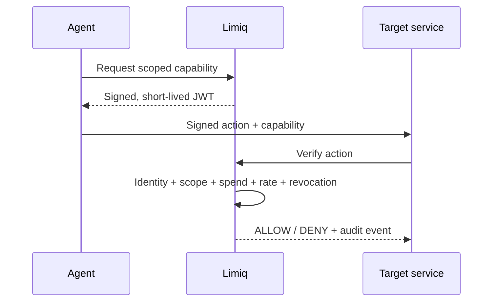

# Limiq

> An AI agent asks to spend EUR 49. Limiq decides whether it can - before money moves.

[](https://github.com/qurveai/limiq.io/actions/workflows/ci.yml)
[](https://www.python.org/)
[](packages/sdk-js)
[](LICENSE)

Limiq is a reference identity and permission layer for autonomous agents. It turns a signed action, a short-lived capability and the current policy into one deterministic answer: `ALLOW` or `DENY`.

It is intentionally a focused `v0.x` system, not an IAM suite.

## See it make a decision

The reference stack boots PostgreSQL, Redis, the API and a purchase target, then runs one allowed purchase and one denied purchase:

```bash
docker compose -f examples/reference-implementation/docker-compose.yml \
  up --build --abort-on-container-exit agent-demo
```

Expected business result:

```text
ALLOW  EUR 49  -> purchase executed
DENY   EUR 149 -> SPEND_LIMIT_EXCEEDED
```

## The trust path



The security boundary is deliberately small:

| Concern | Implementation |
| --- | --- |
| Tenant access | Workspace ID + HMAC-derived workspace key |
| Agent identity | Ed25519 public keys and signed canonical envelopes |
| Delegation | Short-lived EdDSA capability JWTs bound to agent, workspace and target |
| Money | Exact `Decimal` comparisons, currency binding, policy and token limits |
| Revocation | Agent and capability revocation with fail-closed Redis rate limiting |
| Evidence | Append-only audit events linked by a per-workspace hash chain |

## Run it for development

Prerequisites: Python 3.12+, Docker and `make`.

```bash
cp apps/api/.env.example apps/api/.env
make generate-dev-keypair       # paste the two printed values into apps/api/.env
# set LIMIQ_WORKSPACE_BOOTSTRAP_TOKEN and LIMIQ_WORKSPACE_AUTH_SECRET in apps/api/.env
docker compose up -d
make install
make migrate-up
make dev
```

Then open [Swagger UI](http://localhost:8000/docs). `POST /workspaces` returns the workspace API key once; send it as `X-Workspace-Key` with `X-Workspace-Id` on tenant routes.

## One repository, three proofs

- [`apps/api`](apps/api) - FastAPI verification core, policies, capabilities, revocation and audit integrity.
- [`packages/sdk-js`](packages/sdk-js) and [`packages/sdk-python`](packages/sdk-python) - cross-language canonical signing and API clients.
- [`apps/playground`](apps/playground) and [`examples`](examples) - an operator playground plus runnable Express/FastAPI integrations.

Useful checks:

```bash
make lint
make test
make verify-all
pnpm --filter @limiq/sdk-js test
pnpm --filter playground build
```

The same canonical JSON vectors are exercised in Python and TypeScript so signatures do not depend on language-specific serialization.

## API surface

The core flow is intentionally linear:

1. Bootstrap a workspace.
2. Register an agent public key.
3. Create and bind a policy.
4. Issue a scoped capability.
5. Verify the signed action.
6. Query or export the audit trail.

```json
{
  "decision": "DENY",
  "reason_code": "SPEND_LIMIT_EXCEEDED",
  "audit_event_id": "b9f..."
}
```

Docs: [`API guide`](docs/API_GUIDE_V01.md) · [`architecture`](docs/ARCHITECTURE_V01.md) · [`threat model`](SECURITY.md) · [`why Limiq`](docs/why-limiq.md)

## Scope and limits

Limiq is a production-minded reference implementation, not a hosted identity provider. It does not include human SSO, RBAC administration, key rotation workflows or multi-region deployment. The current workspace key model is suitable for controlled service-to-service environments; a public multi-user product should put an IdP and managed secret rotation in front of it.

Apache-2.0 - see [`LICENSE`](LICENSE).
